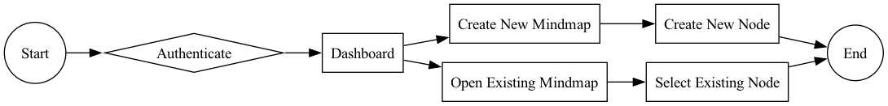
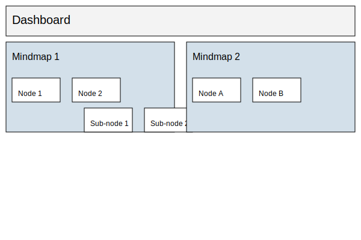

# Mindmap App

This is a sample project for a modern mindmapping application. We aim to create a useful and efficient tool by incorporating best practices in software development, optimizing performance, and offering great customizability.

**Support This Project**

We are looking for funding to help bring this project to life. Support us through:
- [GitHub Sponsors](https://github.com/sponsors/hmltn-0)
- Small contributions via PayPal (link)
- Other avenues (e.g., Patreon, BuyMeACoffee)

Every contribution, no matter how small, helps us move closer to our goal.

Thank you for your support!

## Roadmap

1. Phase 1: Initial Development
   - Set up project structure
   - Implement core features

2. Phase 2: Customization and Extensibility
   - Add customization options
   - Introduce plugin architecture

3. Phase 3: Collaboration and Sharing
   - Implement real-time collaboration
   - Enable mindmap sharing with permissions

4. Phase 4: Performance and Advanced Features
   - Optimize performance
   - Add export and version control features

5. Phase 5: Integration and Final Touches
   - Integrate with third-party services (e.g., Google Drive, Trello)
   - Finalize UI/UX

nnn

