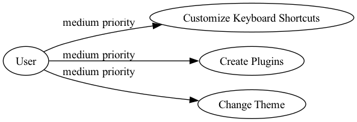

# User Stories

## Introduction
This document outlines the user stories for the Mindmap App. These stories capture the requirements and expectations of our target users, represented by personas. The goal is to create a state-of-the-art mindmapping application that is efficient, customizable, and user-friendly.

## Personas
- **Devon, the Student**: Needs to quickly create and organize study notes and share them with classmates.
- **Andre, the Project Manager**: Needs advanced features for collaborative planning and reporting.
- **Sam, the Developer**: Values customization, extensibility, and performance.

## Core Features

### High Priority
- **User Story**: As Devon, I want to create, edit, and delete mindmaps so that I can organize my ideas effectively.

    **Acceptance Criteria**:
    - I can create a new mindmap from the main dashboard.
    - I can edit the title and contents of a mindmap.
    - I can delete a mindmap by selecting it and confirming the deletion.

- **User Story**: As Devon, I want to add, move, and delete nodes within a mindmap so that I can structure my thoughts in any way I see fit.

    **Acceptance Criteria**:
    - I can add a new node by clicking the add button or using a keyboard shortcut.
    - I can move nodes by dragging them to a new location.
    - I can delete a node by selecting it and pressing the delete button.

- **User Story**: As Andre, I want to be able to connect nodes with lines and arrows so that I can indicate relationships between ideas.

    **Acceptance Criteria**:
    - I can create a connection by selecting two nodes and using a connecting tool.
    - I can modify or delete connections.

### Medium Priority
- **User Story**: As Devon, I want to be able to prioritize and organize nodes by color-coding them so that I can visually distinguish different categories.

    **Acceptance Criteria**:
    - I can assign colors to nodes easily through a right-click menu or toolbar option.
    - The color palette is customizable.

## Customization and Extensibility

### Medium Priority
- **User Story**: As Sam, I want to customize keyboard shortcuts and keybindings so that I can use the application more efficiently based on my workflow.

    **Acceptance Criteria**:
    - I can access a settings menu to customize keyboard shortcuts.
    - My custom shortcuts are saved and persist across sessions.

- **User Story**: As Sam, I want to create plugins and extensions so that I can add new functionality to the application.

    **Technical Feasibility**: Requires implementing a plugin architecture using a framework like Electron with support for APIs.

    **Acceptance Criteria**:
    - There is an API or SDK for creating plugins.
    - I can install, enable, and disable plugins through an extensions manager.

- **User Story**: As Andre, I want to change the theme and appearance of the UI so that it suits my preferences.

    **Acceptance Criteria**:
    - I can select from predefined themes in the settings menu.
    - Advanced users can create and apply custom themes.

## Collaboration and Sharing

### High Priority
- **User Story**: As Andre, I want to share my mindmaps with others so that I can collaborate and get feedback.

    **Acceptance Criteria**:
    - I can share a mindmap link that others can access.
    - I can set permissions (view, edit) for shared mindmaps.

- **User Story**: As Andre, I want real-time collaboration features so that multiple users can work on the same mindmap simultaneously.

    **Acceptance Criteria**:
    - Multiple users can edit the same mindmap in real-time.
    - Changes made by collaborators are reflected immediately.

- **User Story**: As Andre, I want to create and configure user permissions for shared mindmaps.

    **Dependencies**: Requires the ability to share mindmaps.

    **Acceptance Criteria**:
    - I can set access permissions (view, edit, comment) for each user.
    - Permissions are saved and applied correctly.

## Performance and Simplicity

### High Priority
- **User Story**: As Devon, I want the application to load quickly and run smoothly so that it does not hinder my productivity.

    **Acceptance Criteria**:
    - The application loads within 3 seconds on a standard machine.
    - No noticeable lag during normal usage.

- **User Story**: As Devon, I want a clean, minimalist UI so that I am not distracted by unnecessary elements while working on my mindmap.

    **Acceptance Criteria**:
    - The UI follows a simple, consistent design language.
    - Options and menus are hidden or collapsed by default, with the option to expand them as needed.

## Advanced Features

### Medium Priority
- **User Story**: As Andre, I want to export my mindmaps to various formats (e.g., PDF, image) so that I can easily share them or include them in reports.

    **Acceptance Criteria**:
    - There are options to export mindmaps as PDF and image files.
    - Exported files maintain the structure and styling of the mindmap.

- **User Story**: As Devon, I want version control and history tracking so that I can revert to previous versions of my mindmaps if needed.

    **Acceptance Criteria**:
    - All changes to mindmaps are logged and can be viewed in a history.
    - I can revert to any previous version from the history log.

## Integration

### Medium Priority
- **User Story**: As Andre, I want the app to integrate with other tools like Google Drive and Trello so that I can seamlessly manage my data.

    **Acceptance Criteria**:
    - I can connect my Google Drive and Trello accounts.
    - I can import and export data to and from these services.

## Goal-Oriented Vision

### Long-term Priority
- **User Story**: As a project team, we aim to make this mindmapping application the top choice in the market by focusing on performance, extensibility, user customization, and a superior user experience.

    **Business Goal**: Increase user retention by offering personalized user experiences.

    **Metrics**: Track the number of customized themes created and user retention rates over time.

    **Acceptance Criteria**:
    - User feedback shows high satisfaction with performance and customization options.
    - The application is regularly updated with new features and improvements based on community feedback.

